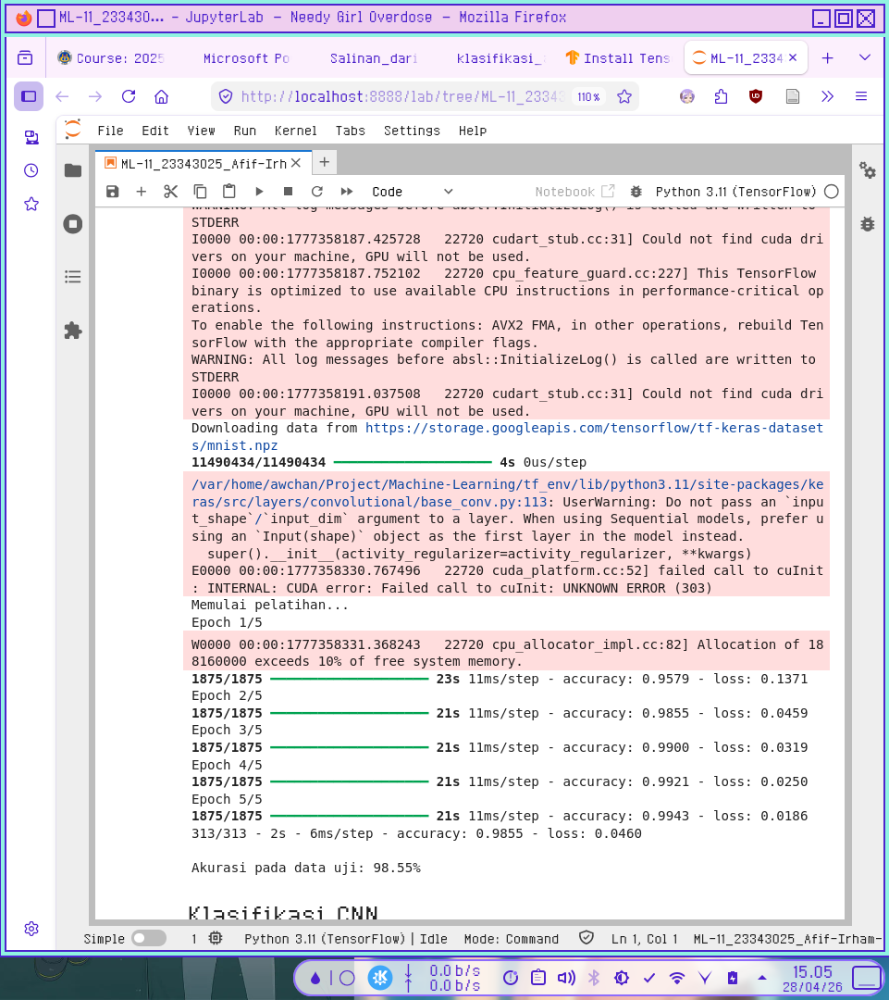
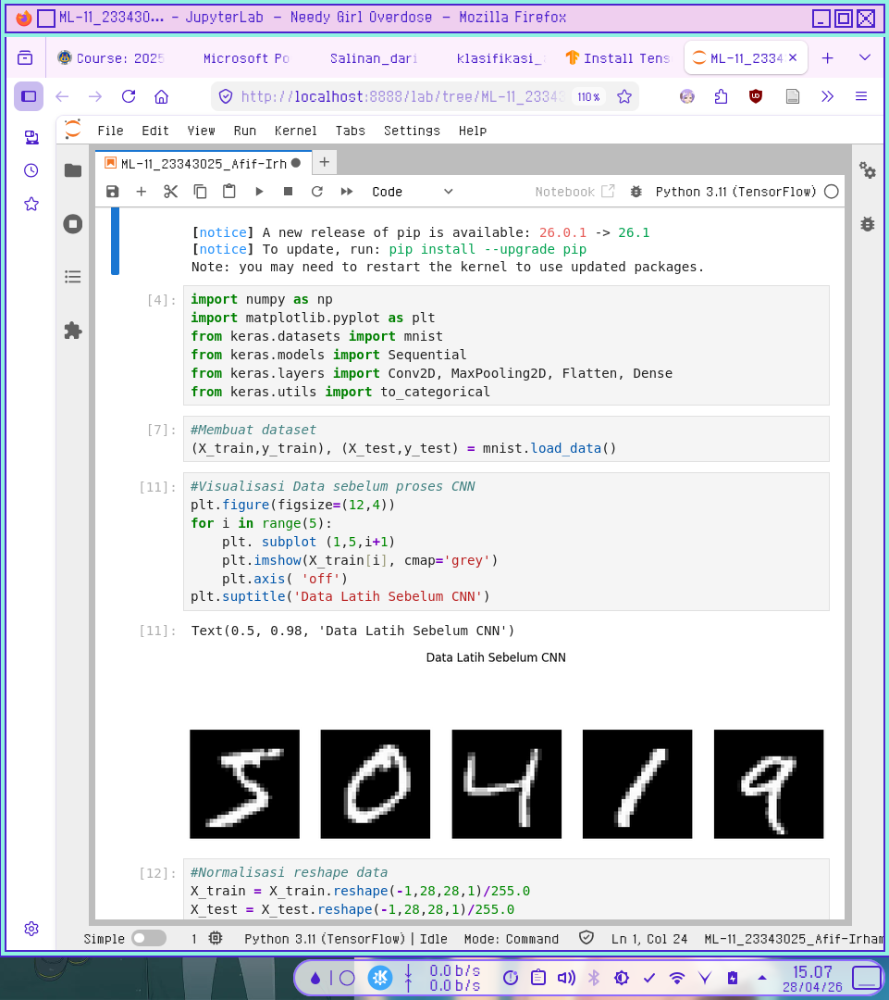
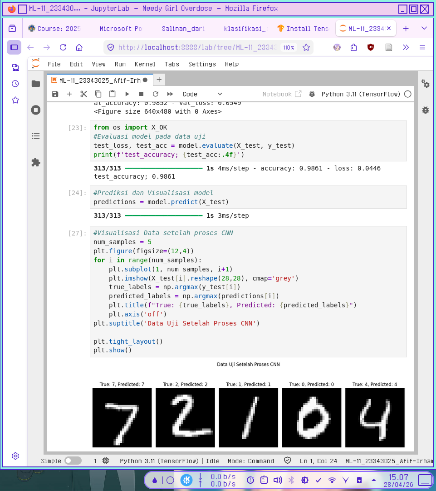

# Klasifikasi CNN

## Catatan sebelum mulai

- TensorFlow tidak bekerja pada python versi terbaru  (3.14)  
```
python --version
Python 3.14.3
```

Untuk mengatasinya saya membuat environment baru dengan python versi 3.11  

Since i am on Linux and using a version of Jupyter installed via **Homebrew**, we’ll stick to the standard terminal commands. We are going to create a virtual environment with a compatible version of Python (3.11) so TensorFlow can actually find a version to download.

Here is the step-by-step to get this working:

### 1. Install a compatible Python version

```
brew install python@3.11 
```

### 2. Create the Virtual Environment
Navigate to project folder in the terminal and run:

```
python3.11 -m venv tf_env
```

### 3. Activate and Install
Now, "step into" that environment and install TensorFlow.

```
source tf_env/bin/activate
```
> you can adjust it to suit your shell 

```
pip install --upgrade pip

pip install tensorflow
```

### 4. Connect the venv to Jupyter
This is the most important part. Since we installed Jupyter via `brew`, it lives in a different place. We need to tell Homebrew Jupyter that this new environment exists by installing an **ipykernel**.

```
# While still in the activated (tf_env)
pip install ipykernel

# Register this environment as a "Kernel" in Jupyter
python -m ipykernel install --user --name=tf_env --display-name "Python 3.11 (TensorFlow)"
```

---

### 5. Launch Jupyter and Switch
We can now start Jupyter as you normally do

1. Open your `.ipynb` file.
2. In the top right corner, click on the kernel name (it probably says "Python 3").
3. Select **"Python 3.11 (TensorFlow)"** from the list.

Alright enough of that.

---

## Screenshot Kode Python

  

  

  
