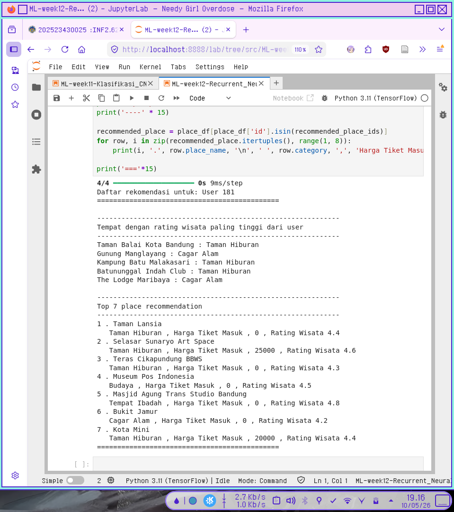
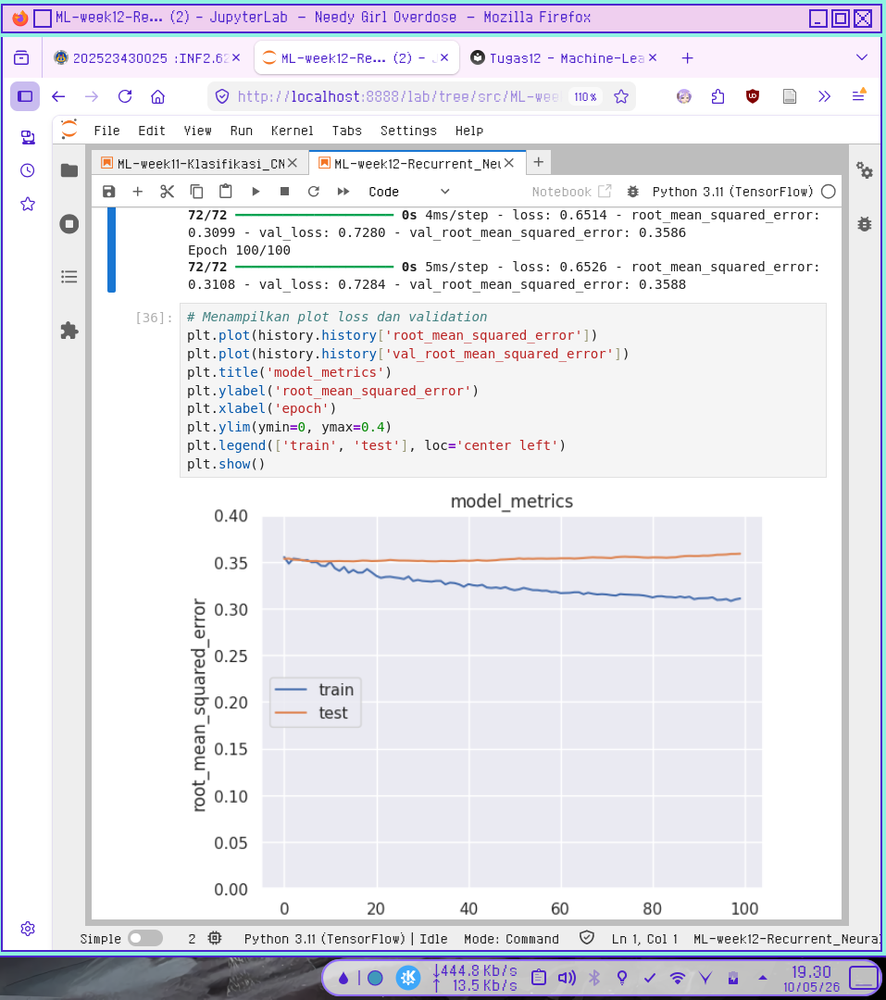
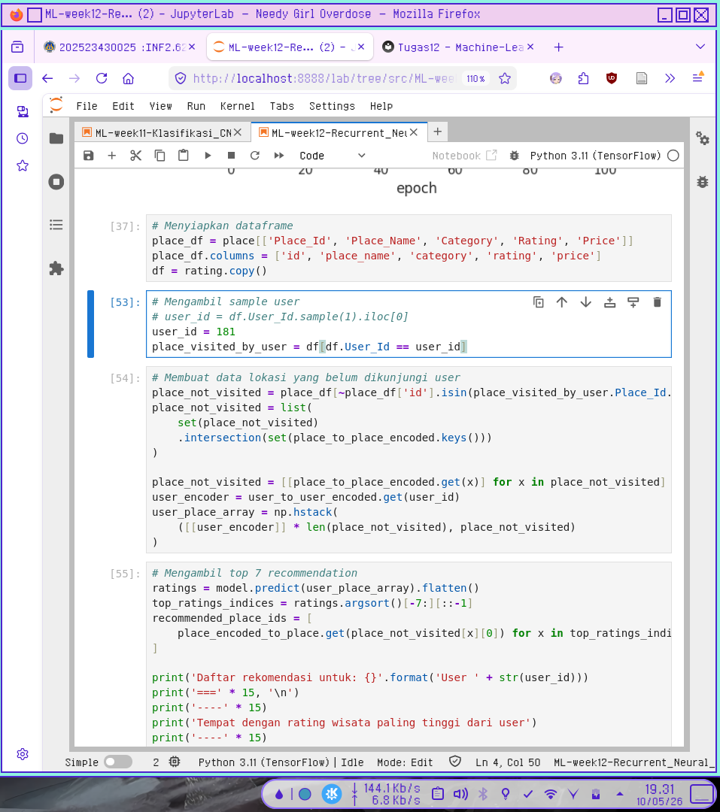
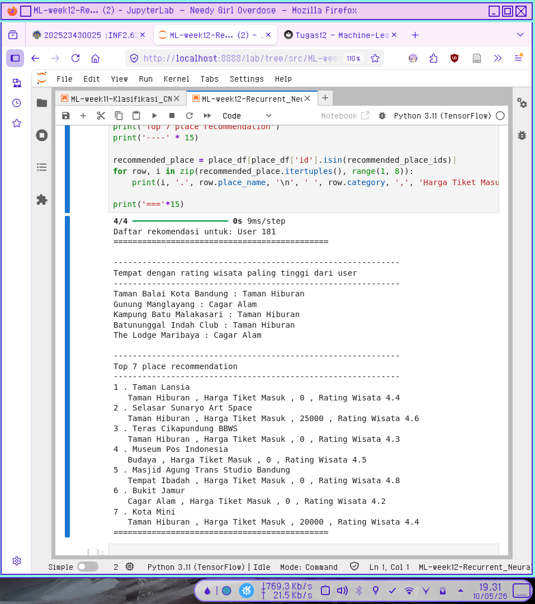
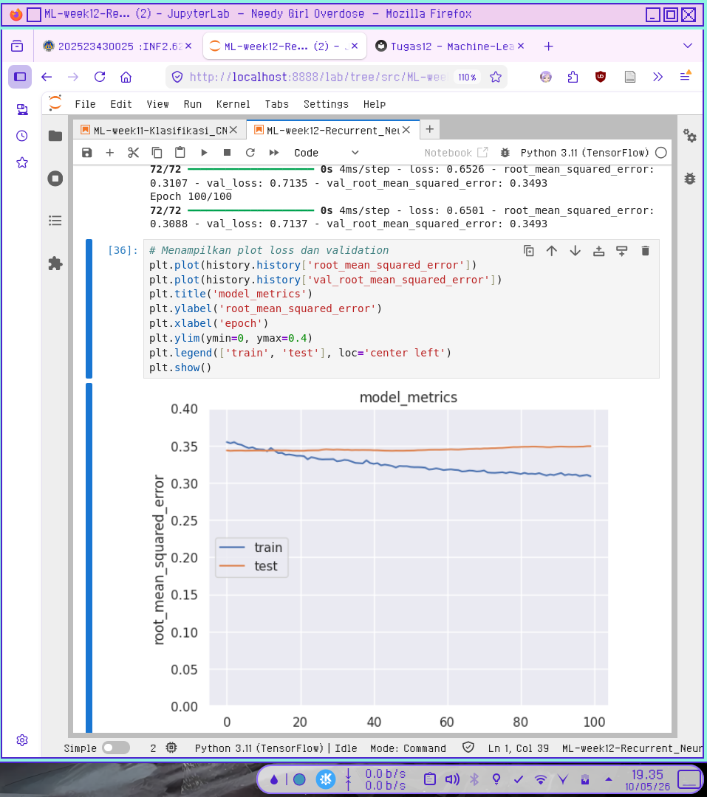
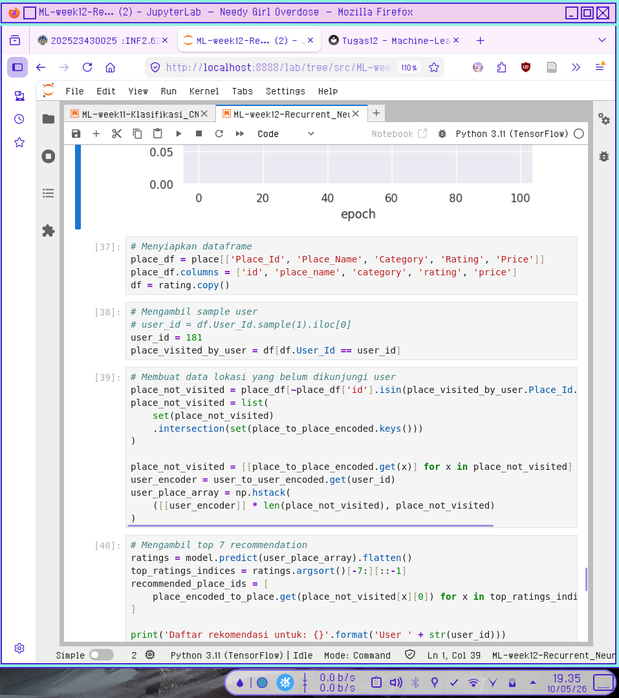
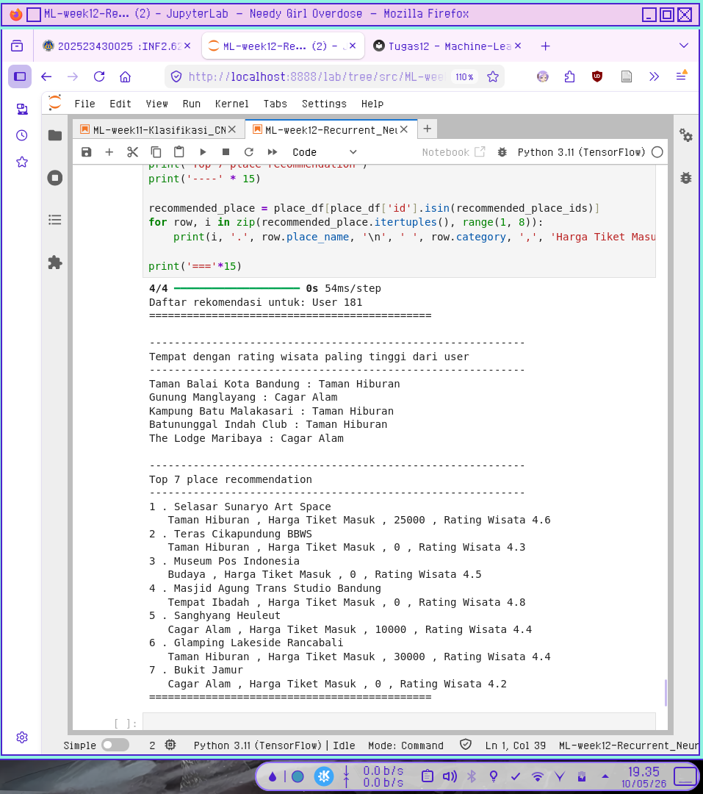

# Laporan Tugas 12 Recurrent Neural Network

## Screenshot Kode Python

  

Berdasarkan hasil observasi output final selalu berubah-ubah setiap training model dilakukan.  

Dengan kode yang ada pada jobsheet sample user dipilih secara random tapi bisa ditentukan secara spesifik dengan mengubah kode dari:
```
# Mengambil sample user
user_id = df.User_Id.sample(1).iloc[0]
place_visited_by_user = df[df.User_Id == user_id]
```

- **Menjadi:**

```
# Mengambil sample user
# user_id = df.User_Id.sample(1).iloc[0]
user_id = 181
place_visited_by_user = df[df.User_Id == user_id]
```

Bukti kalau training ulang akan mengubah hasil:

### **Before:**

  

  

  

### **After:**

  

  

  


> Dapat dilihat pada gambar ada perbedaan yang cukup jelas setelah dilakukan observasi.
