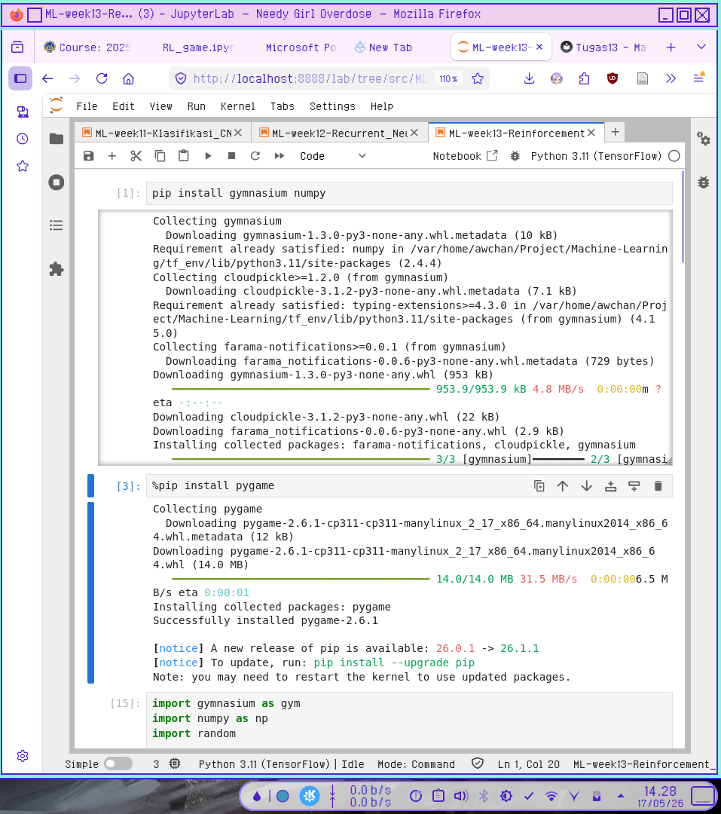
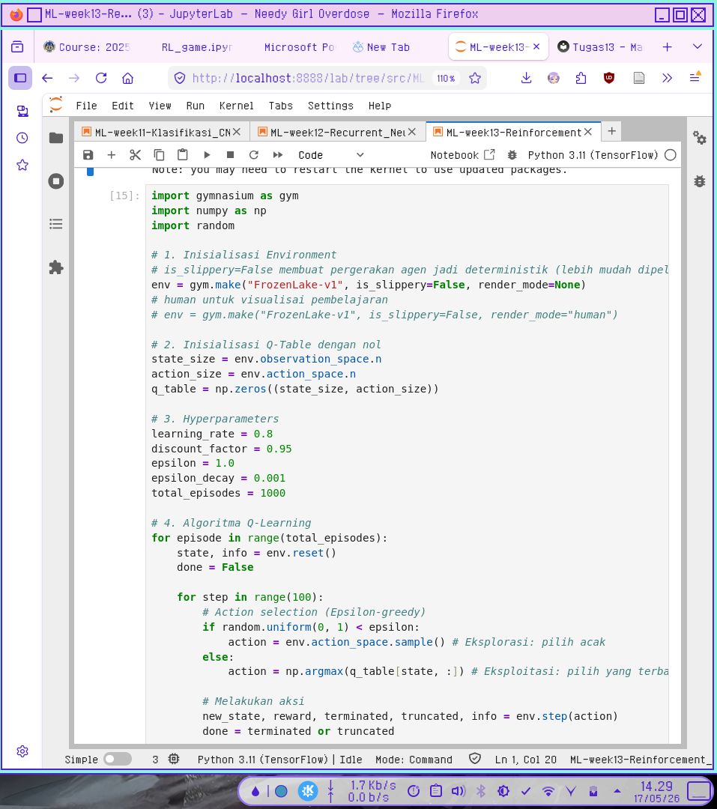
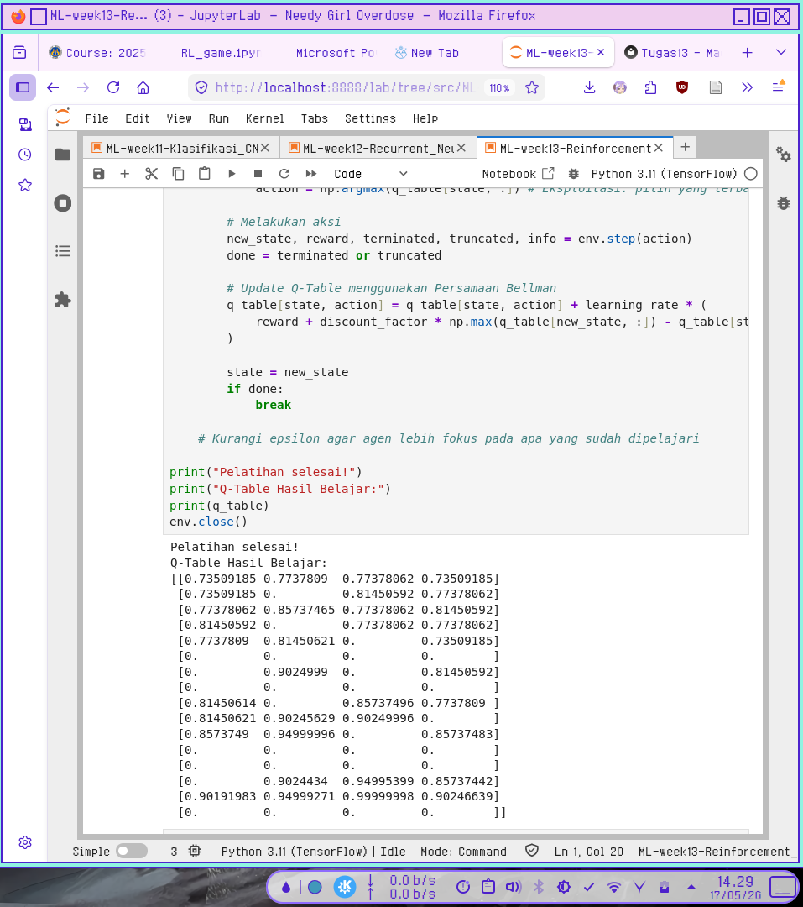
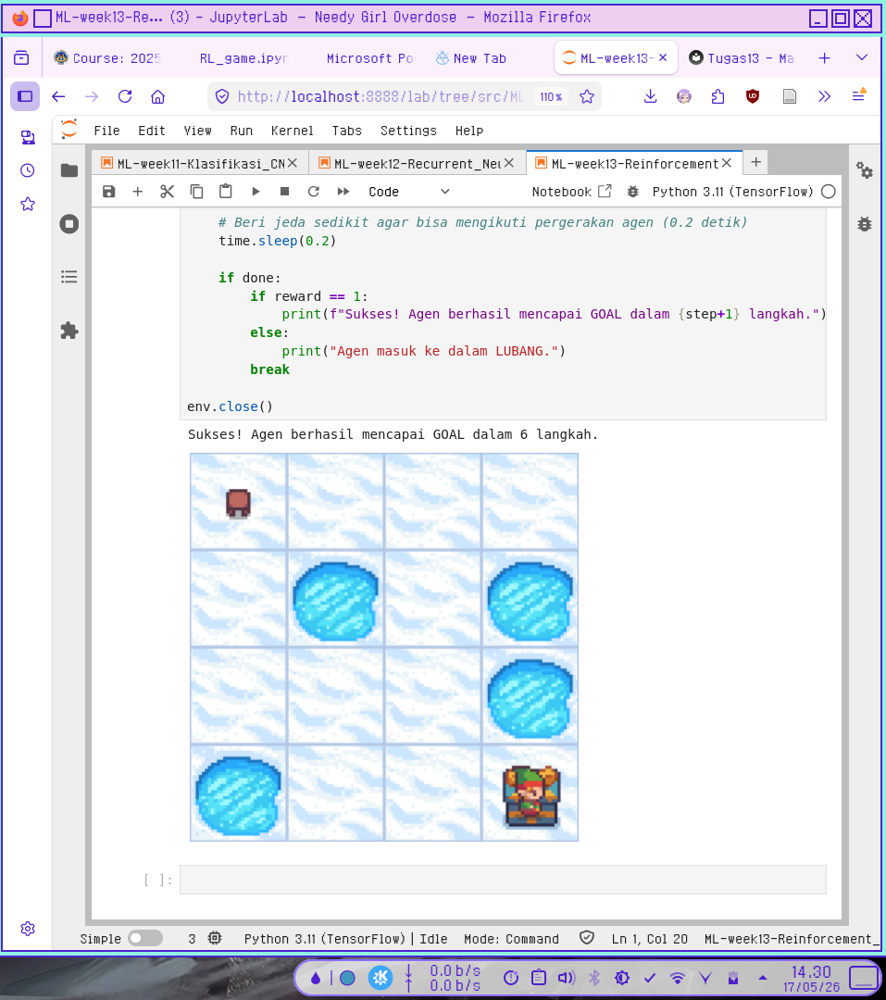

# Reinforcement Learning

Referensi hasil output Q-table pada pelatihan saya:
```
Pelatihan selesai!
Q-Table Hasil Belajar:
[[0.73509185 0.7737809  0.77378062 0.73509185]
 [0.73509185 0.         0.81450592 0.77378062]
 [0.77378062 0.85737465 0.77378062 0.81450592]
 [0.81450592 0.         0.77378062 0.77378062]
 [0.7737809  0.81450621 0.         0.73509185]
 [0.         0.         0.         0.        ]
 [0.         0.9024999  0.         0.81450592]
 [0.         0.         0.         0.        ]
 [0.81450614 0.         0.85737496 0.7737809 ]
 [0.81450621 0.90245629 0.90249996 0.        ]
 [0.8573749  0.94999996 0.         0.85737483]
 [0.         0.         0.         0.        ]
 [0.         0.         0.         0.        ]
 [0.         0.9024434  0.94995399 0.85737442]
 [0.90191983 0.94999271 0.99999998 0.90246639]
 [0.         0.         0.         0.        ]]
```

Berikut adalah panduan mudah untuk membaca dan memahami isi dari Q-Table tersebut.

---

## 1. Memahami Struktur: Baris dan Kolom

Q-Table adalah tabel pencarian (lookup table) di mana agen menyimpan "pengetahuan" yang sudah dipelajarinya.

* **Baris (Indeks 0 sampai 15):** Menandakan **State (State/Posisi)** agen di dalam lingkungan. Jika ini adalah grid 4x4, State 0 adalah pojok kiri atas, dan State 15 adalah pojok kanan bawah.
* **Kolom (Indeks 0 sampai 3):** Menandakan **Action (Aksi)** yang bisa diambil oleh agen. Standardnya dalam lingkungan *gym* (seperti Frozen Lake), urutan aksinya adalah:
* Kolom 0: **Kiri (Left)**
* Kolom 1: **Bawah (Down)**
* Kolom 2: **Kanan (Right)**
* Kolom 3: **Atas (Up)**


---

## 2. Arti dari Angka di Dalam Tabel (Q-Value)

Angka-angka di dalam tabel tersebut disebut **Q-Value**. Angka ini merepresentasikan **seberapa keuntungan atau hadiah (reward) masa depan yang diharapkan** jika agen mengambil aksi tertentu di state tertentu.

* **Semakin besar angkanya, semakin bagus aksi tersebut.**
* **Angka `0.**` berarti agen tidak pernah mendapatkan reward dari sana, atau posisi tersebut adalah *Dead End* / Lubang (Hole) di mana permainan langsung berakhir sebelum mendapat reward.

---

## 3. Cara Membaca Kasus Spesifik (Contoh Analisis)

Mari kita bedah beberapa baris menarik dari tabel:

### Contoh 1: State Berisi Lubang atau Goal (Semua `0.`)

Perhatikan **Baris 5, 7, 11, dan 12**:

```text
[0.         0.         0.         0.        ]

```

Semua nilai di baris ini adalah nol. Dalam Frozen Lake, ini menandakan **Terminal State**. State 5, 7, 11, dan 12 adalah **Lubang (Hole)**. Begitu agen masuk ke sini, game berakhir (nyemplung), sehingga tidak ada aksi lanjutan yang bernilai. Baris 15 juga berisi nol karena itu adalah **Goal (Finish)**, tempat permainan selesai.

### Contoh 2: State Mendekati Kemenangan (State 14)

Perhatikan **Baris 14** (State tepat di sebelah kiri Goal):

```text
[0.90191983 0.94999271 0.99999998 0.90246639]

```

* Jika agen bergerak ke Kiri (Kolom 0): Nilainya `0.901`
* Jika agen bergerak ke Bawah (Kolom 1): Nilainya `0.949`
* Jika agen bergerak ke **Kanan (Kolom 2)**: Nilainya **`0.99999998`** (Hampir sempurna `1.0`)
* Jika agen bergerak ke Atas (Kolom 3): Nilainya `0.902`

Dari sini kita tahu, jika agen berada di State 14, aksi terbaiknya adalah **Kanan** karena nilai Q-nya paling tinggi. Dan benar saja, di sebelah kanan State 14 adalah State 15 (Goal)!

---

## 4. Cara Agen Menggunakan Tabel Ini (Kebijakan / Policy)

Setelah pelatihan selesai, agen tidak lagi menjelajah secara acak. Agen akan menggunakan mode **Eksploitasi (Exploitation)** dengan prinsip *Argmax* (mencari indeks kolom dengan nilai tertinggi di baris tersebut).

Mari kita petakan jalan pintas (Policy) yang dipelajari agen Anda dari State awal (0) menuju Goal (15):

| State (Baris) | Q-Values | Aksi Terbaik (Nilai Tertinggi) |
| --- | --- | --- |
| **State 0** | `[0.735, 0.7737809, 0.77378062, 0.735]` | **Bawah** (Indeks 1: `0.7737809`) |
| **State 4** | `[0.773, 0.81450621, 0., 0.735]` | **Bawah** (Indeks 1: `0.81450621`) |
| **State 8** | `[0.814, 0., 0.85737496, 0.773]` | **Kanan** (Indeks 2: `0.85737496`) |
| **State 9** | `[0.814, 0.90245629, 0.90249996, 0.]` | **Kanan** (Indeks 2: `0.90249996`) |
| **State 10** | `[0.857, 0.94999996, 0., 0.857]` | **Bawah** (Indeks 1: `0.94999996`) |
| **State 14** | `[0.901, 0.949, 0.99999998, 0.902]` | **Kanan** (Indeks 2: `0.99999998`) |
| **State 15** | `[0., 0., 0., 0.]` | **GOAL!** |

---

## Screenshot Kode Python

  

  

  

  
