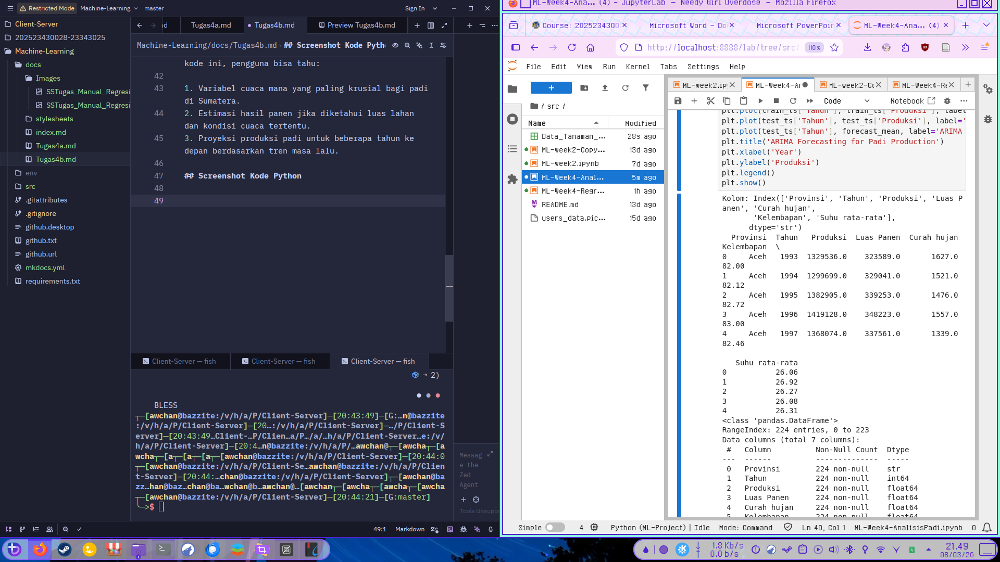
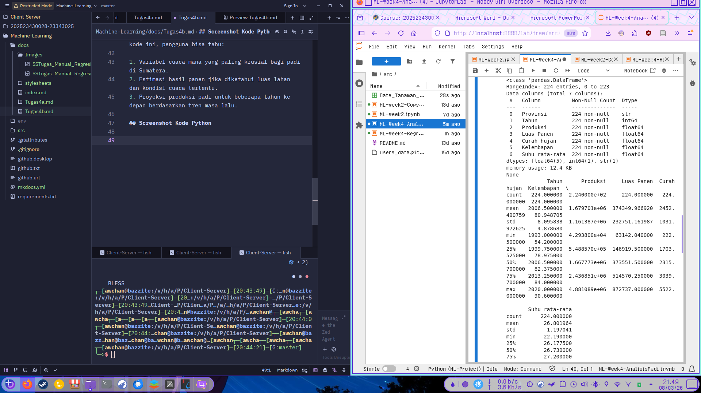
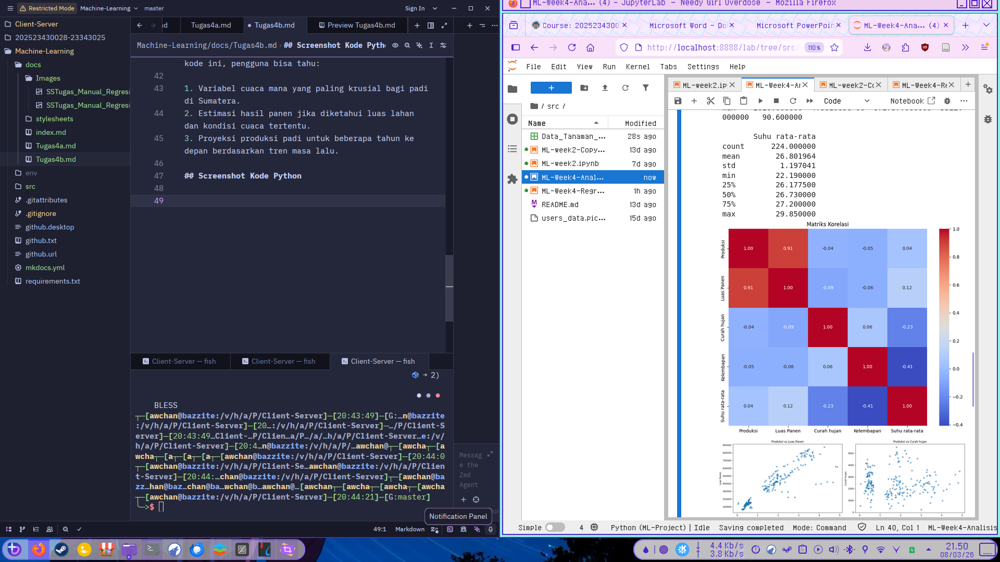
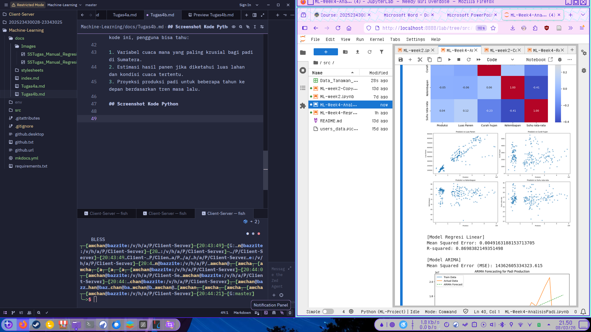
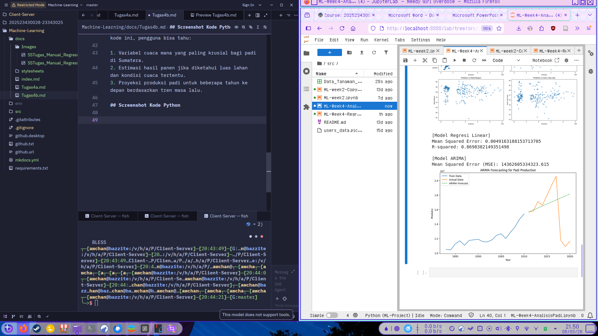

## Catatan Singkat

Secara garis besar, tujuannya adalah untuk memahami faktor-faktor yang memengaruhi hasil panen padi dan membangun sistem yang dapat memprediksi jumlah produksi di masa depan.

---

### 1. Eksplorasi dan Pembersihan Data (EDA)

Kode ini bertujuan untuk mengenali karakteristik data sebelum diolah.

* **Identifikasi Hubungan:** Menggunakan **Heatmap Korelasi** untuk melihat variabel mana (seperti Luas Panen, Curah Hujan, atau Suhu) yang memiliki pengaruh paling kuat terhadap jumlah **Produksi**.
* **Visualisasi Tren:** Melalui *Scatter Plots*, kode ini mencoba melihat pola sebaran data, misalnya apakah peningkatan luas panen berbanding lurus secara linear dengan hasil produksi.

### 2. Preprocessing (Penyiapan Data)

Sebelum masuk ke mesin pembelajaran (machine learning), data dibersihkan agar model bekerja akurat:

* **Handling Missing Values:** Mengisi data yang kosong dengan nilai rata-rata (*mean*) agar tidak terjadi error saat perhitungan.
* **Normalisasi (MinMaxScaler):** Menyamakan skala semua variabel (misalnya suhu yang berkisar 20–30°C vs luas panen yang ribuan hektar) ke rentang 0 hingga 1. Ini penting agar model tidak "pilih kasih" terhadap variabel dengan angka yang besar.

### 3. Pemodelan Prediktif (Machine Learning)

Kode ini menggunakan dua pendekatan berbeda untuk mencapai tujuan yang berbeda pula:

| Model | Jenis | Tujuan Utama |
| --- | --- | --- |
| **Regresi Linear** | Supervised Learning | Memprediksi jumlah produksi berdasarkan **faktor eksternal** (Luas panen, Curah hujan, Kelembapan, Suhu). |
| **ARIMA** | Time Series | Memprediksi jumlah produksi di masa depan berdasarkan **pola historis** (urutan waktu/tahun) tanpa melihat faktor cuaca. |

### 4. Evaluasi Performa

Tujuan akhirnya adalah mengukur seberapa akurat prediksi tersebut menggunakan:

* **Mean Squared Error (MSE):** Menghitung rata-rata kesalahan kuadrat. Semakin kecil nilainya, semakin akurat modelnya.
* **R-squared ($R^2$):** Menilai seberapa besar pengaruh variabel independen (cuaca/luas lahan) dalam menjelaskan variasi jumlah produksi.

---

### Kesimpulan

Tujuan utama dari kode ini adalah **membuat alat pendukung keputusan** bagi sektor pertanian. Dengan kode ini, pengguna bisa tahu:

1. Variabel cuaca mana yang paling krusial bagi padi di Sumatera.
2. Estimasi hasil panen jika diketahui luas lahan dan kondisi cuaca tertentu.
3. Proyeksi produksi padi untuk beberapa tahun ke depan berdasarkan tren masa lalu.

## Screenshot Kode Python

---

---

---

---

