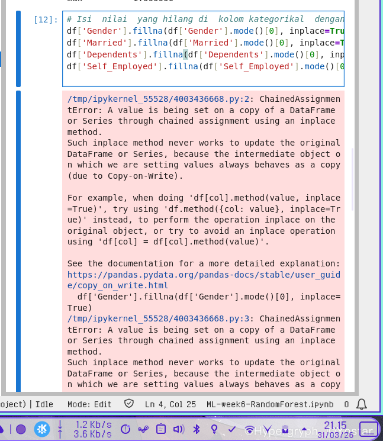
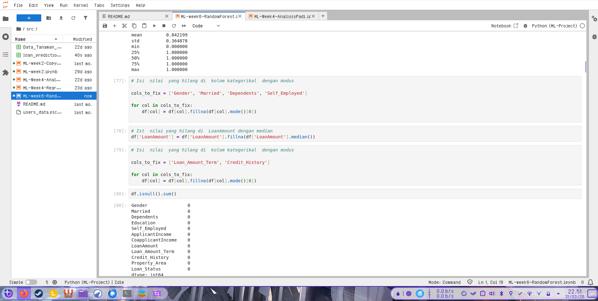
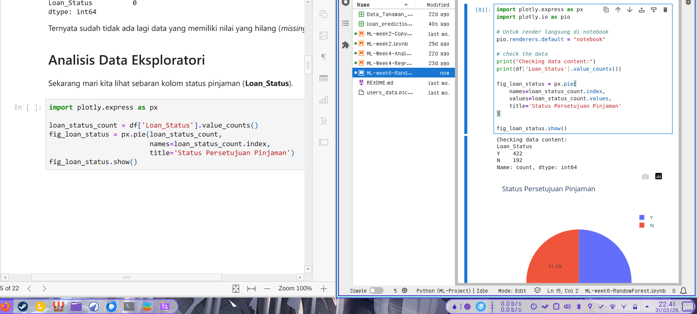
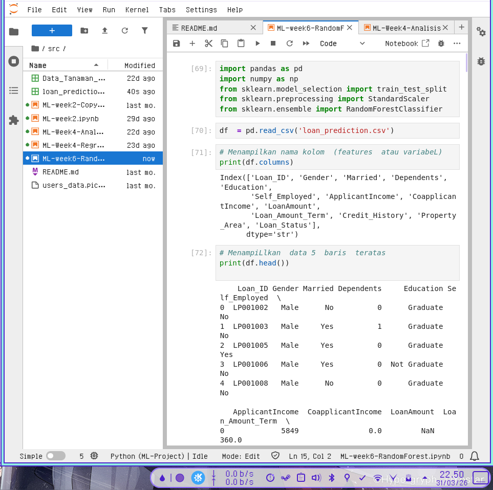
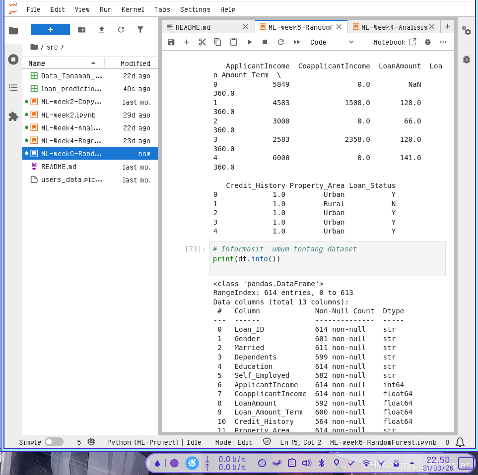
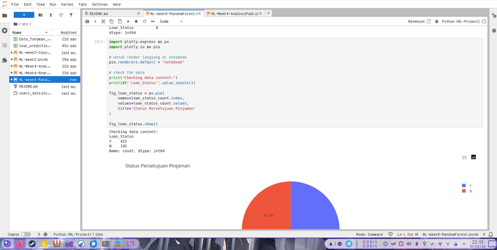
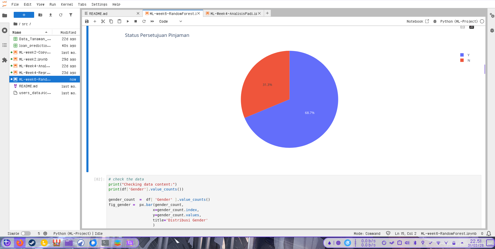
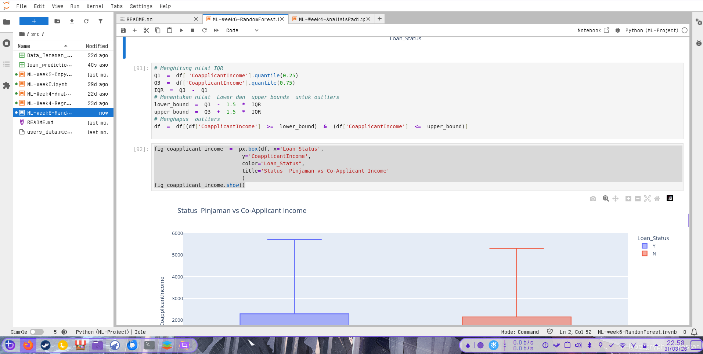
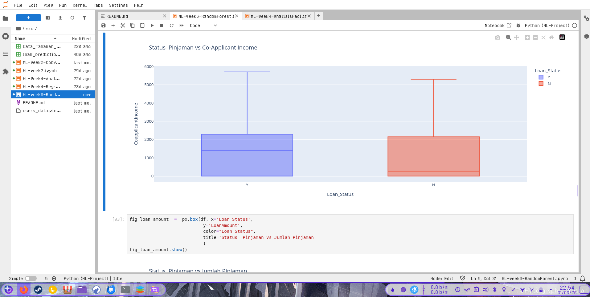
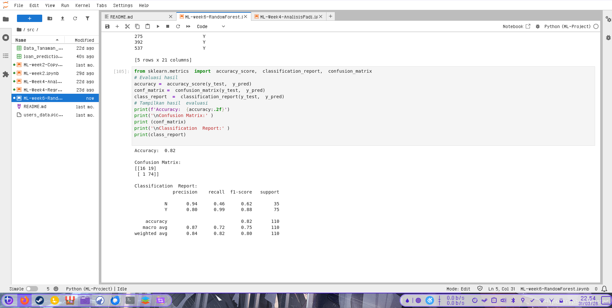

# Laporan Tugas 6 Random Forest

## Kendala

### Syntax issue


perbaikannya 



### Renderer Issue

tidak bisa menampilkan plot di window jadi harus dipaksa untuk render langsung di notebook

Diperbaiki dengan menambahkan

```markdown
pio.renderers.default = "notebook"
```




Beberapa Screenshot dari tugas ini


  

    

  

  



  

