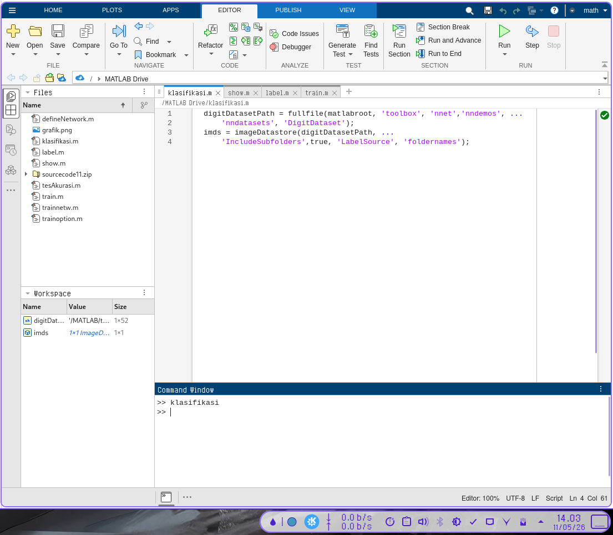
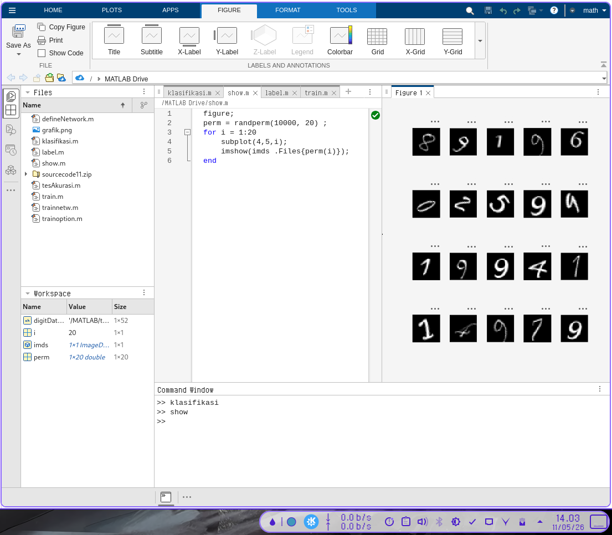
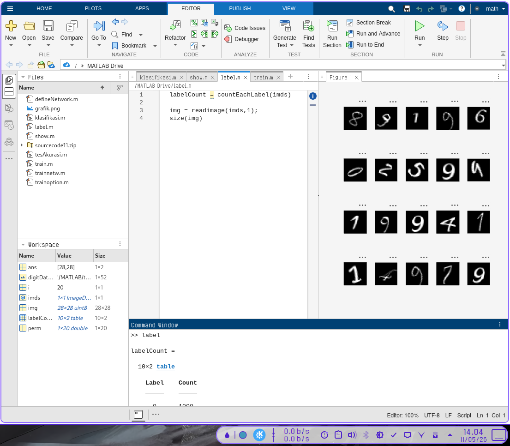
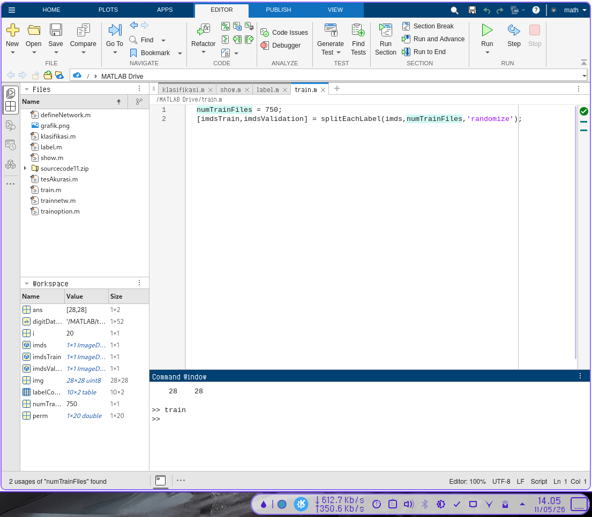
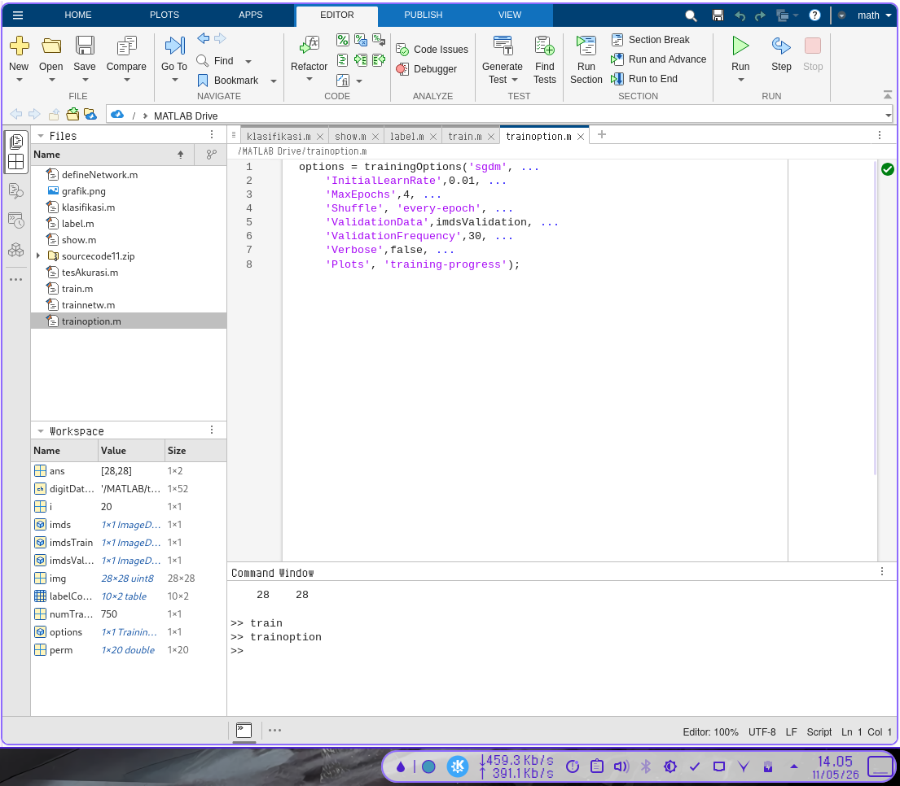
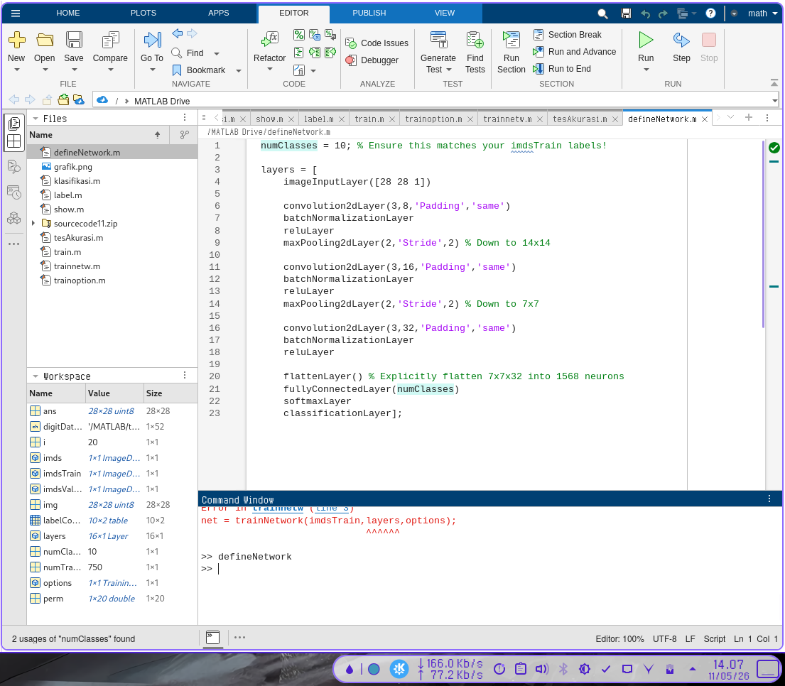
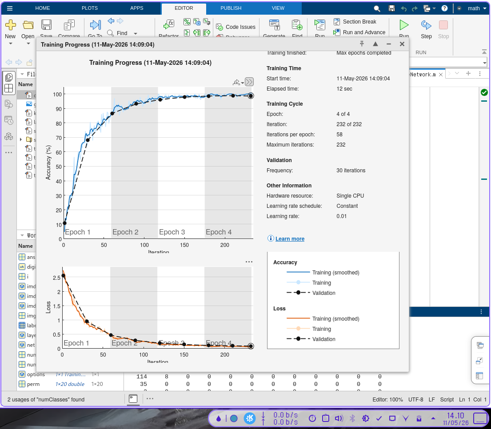
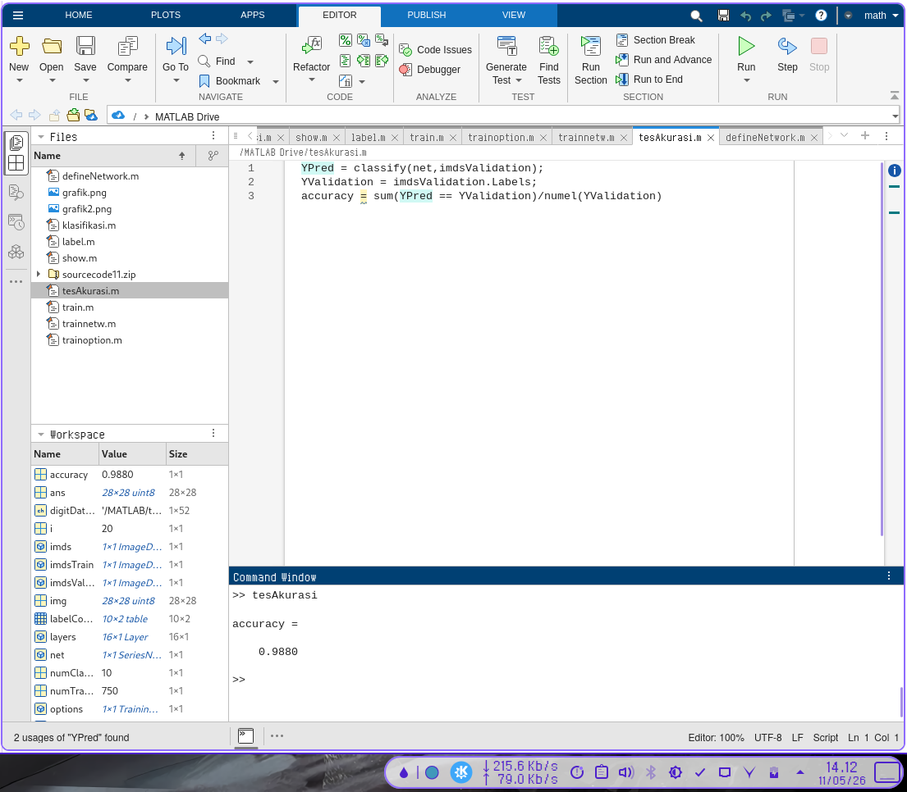

# Penerapan CNN Menggunakan Matlab

## Goal
Mengklasifikasi angka-angka (0-9) berupa citra tulisan tangan.

---

## 1. Load and Explore Image Data

`imageDatastore` secara otomatis melabeli gambar berdasarkan nama folder dan menyimpan datanya sebagai objek `ImageDatastore`. Sebuah datastore gambar memungkinkan Anda untuk menyimpan data gambar yang besar, termasuk data yang tidak muat di dalam memori, serta membaca kumpulan (batch) gambar secara efisien selama pelatihan jaringan saraf konvensional (*convolutional neural network*).

```matlab
digitDatasetPath = fullfile(matlabroot, 'toolbox', 'nnet', 'nndemos', ...
    'nndatasets', 'DigitDataset');
imds = imageDatastore(digitDatasetPath, ...
    'IncludeSubfolders', true, 'LabelSource', 'foldernames');
```

### Display Image
Menampilkan beberapa sampel gambar dari dataset secara acak.

```matlab
figure;
perm = randperm(10000, 20);
for i = 1:20
    subplot(4, 5, i);
    imshow(imds.Files{perm(i)});
end
```

### Eksplorasi Data
Menghitung jumlah gambar di setiap kategori. `labelCount` adalah sebuah tabel yang berisi label-label dan jumlah gambar yang memiliki masing-masing label tersebut. Datastore ini berisi 1000 gambar untuk setiap digit 0-9, dengan total keseluruhan 10.000 gambar.

```matlab
labelCount = countEachLabel(imds)

% Melihat ukuran citra
img = readimage(imds, 1);
size(img)
```

---

## 2. Specify Training and Validation Sets

Bagi data menjadi kumpulan data pelatihan (*training*) dan validasi, sehingga setiap kategori dalam kumpulan pelatihan berisi 750 gambar, dan kumpulan validasi berisi sisa gambar dari setiap label. `splitEachLabel` membagi datastore `imds` menjadi dua datastore baru, yaitu `imdsTrain` dan `imdsValidation`.

```matlab
numTrainFiles = 750;
[imdsTrain, imdsValidation] = splitEachLabel(imds, numTrainFiles, 'randomize');
```

---

## 3. Define Network Architecture

Mendefinisikan struktur lapisan untuk *Convolutional Neural Network*.

```matlab
layers = [
    % Lapisan Input Gambar
    imageInputLayer([28 28 1])
    
    % Lapisan Konvolusi 1
    convolution2dLayer(3, 8, 'Padding', 'same')
    batchNormalizationLayer
    reluLayer
    
    % Lapisan Max Pooling 1
    maxPooling2dLayer(2, 'Stride', 2)
    
    % Lapisan Konvolusi 2
    convolution2dLayer(3, 16, 'Padding', 'same')
    batchNormalizationLayer
    reluLayer
    
    % Lapisan Max Pooling 2
    maxPooling2dLayer(2, 'Stride', 2)
    
    % Lapisan Konvolusi 3
    convolution2dLayer(3, 32, 'Padding', 'same')
    batchNormalizationLayer
    reluLayer
    
    % Lapisan Terhubung Penuh (Fully Connected)
    fullyConnectedLayer(10)
    softmaxLayer
    classificationLayer];
```

### Penjelasan Lapisan:
*   **Image Input Layer:** Menentukan ukuran gambar (28x28x1). Saluran warna 1 menunjukkan gambar *grayscale*.
*   **Convolutional Layer:** Menggunakan filter berukuran 3x3. Padding 'same' memastikan ukuran output sama dengan input.
*   **Batch Normalization Layer:** Menormalkan aktivasi dan gradien untuk mempercepat pelatihan.
*   **ReLU Layer:** Fungsi aktivasi non-linear yang paling umum digunakan.
*   **Max Pooling Layer:** Mengurangi ukuran spasial peta fitur (*down-sampling*) dengan mengambil nilai maksimum dalam wilayah 2x2.
*   **Fully Connected Layer:** Menghubungkan semua neuron untuk mengidentifikasi pola yang lebih besar. OutputSize disesuaikan dengan jumlah kelas (10).
*   **Softmax Layer:** Menormalkan output menjadi probabilitas klasifikasi.
*   **Classification Layer:** Menghitung kerugian (*loss*) dan menetapkan input ke salah satu kelas.

---

## 4. Specify Training Options

Tentukan opsi pelatihan menggunakan *stochastic gradient descent with momentum* (SGDM).

```matlab
options = trainingOptions('sgdm', ...
    'InitialLearnRate', 0.01, ...
    'MaxEpochs', 4, ...
    'Shuffle', 'every-epoch', ...
    'ValidationData', imdsValidation, ...
    'ValidationFrequency', 30, ...
    'Verbose', false, ...
    'Plots', 'training-progress');
```

---

## 5. Train Network Using Training Data

Latih jaringan menggunakan arsitektur yang telah ditentukan, data pelatihan, dan opsi pelatihan.

```matlab
net = trainNetwork(imdsTrain, layers, options);
```

Secara default, `trainNetwork` akan menggunakan GPU jika tersedia, atau CPU jika tidak tersedia. Plot kemajuan pelatihan akan menunjukkan *loss* dan akurasi selama proses berlangsung.

---

## 6. Classify Validation Images and Compute Accuracy

Prediksi label dari data validasi menggunakan jaringan yang telah dilatih, dan hitung akurasi validasi akhir.

```matlab
YPred = classify(net, imdsValidation);
YValidation = imdsValidation.Labels;

accuracy = sum(YPred == YValidation) / numel(YValidation)
```

Akurasi adalah pecahan dari label yang diprediksi dengan benar. Dalam kasus ini, akurasi biasanya mencapai lebih dari 99%.


## 7.Screenshot Kode Python

  


  


  

  

  

  

  

  
